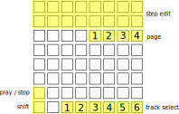

# Thunk

Thunk is a parameter locking step sequencer for the [monome norns](https://monome.org/docs/norns/).

# Install

From maiden type

```
;install https://github.com/chrislo/thunk
```

# Instructions

Thunk requires a grid. It is optimised for a 8x8 grid but should work on a 16x8. If you have [midigrid](https://norns.community/en/authors/jaggednz/midigrid) installed it will use that.



- Toggle steps using the `step edit` buttons. Each track has up to 64 steps grouped in 4 pages. Select the page using the `page` buttons.
- Use `track select` to choose one of the 6 tracks
- `shift + step edit` to set the length of the track's pattern
- Hold `step edit` to set step parameters
- `shift + track select` to toggle track mutes

## Menus

The script starts in the "global" menu. Use `enc 2` to select a parameter and `enc 3` to change its value.

Press `track select` to set parameters for a specific track.

Press and hold a `step edit` button to set parameters for a specific track.

Press `k2` to go back from the track menu to the global menu.

## Sample management

Thunk has space for 64 samples (stereo or mono). It comes preloaded with the norns default 808 kit. When in the track edit menu, press `k3` on the sample name to load a sample into the slot. Samples can also be managed from the norns `param` menu (press `k1` and turn `e1` to access).

# Roadmap

- MIDI tracks for sequencing external devices
- Synth tracks to complement the sampled sounds
- Nicer menus
